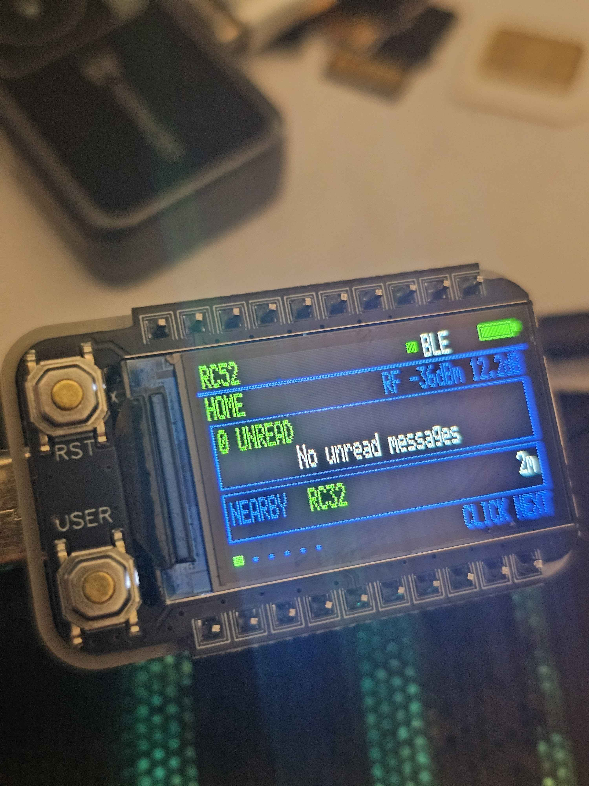

  

# NeonPocketMC-RC52

Experimental MeshCore 1.17 BLE companion firmware for the Heltec RadioCore RC52-L62 with its vendor 220 x 128 NV3001B TFT.

> **RC52 only—do not flash RCC6, RC32, or RC52 variants with different display/radio hardware.**

  

<em>NeonPocketMC Home dashboard on the RC52 qualification unit.</em>

## Release status

The first experimental release, [`v1.0.0-rc.1`](https://github.com/n30nex/NeonPocketMC-RC52/releases/tag/v1.0.0-rc.1), is available now. Use only the files attached to that GitHub Release; short-lived Actions artifacts are development builds.

RC1 is the exact application-only firmware physically run on the RC52 qualification unit and accepted by its owner. It remains a release candidate, not a final stable release.

The port is pinned to MeshCore 1.17.0 at upstream commit [`727fc0512ce08bfd7b499e46daa7fca6eeec730d`](https://github.com/meshcore-dev/MeshCore/commit/727fc0512ce08bfd7b499e46daa7fca6eeec730d). The RCC6 project supplied the visual reference only; its ESP32 hardware, Web/AP transport, and release history are not included.

## What is included

- One target: `heltec_rc52_companion_radio_ble`
- BLE companion transport only
- Native 220 x 128 RGB565 NeonPocket dashboard and inbox
- Animated NeonPocketMC startup mark and progress sequence
- One hardware-SPI framebuffer with 8-row delta flushing
- Home, Inbox, Nearby, Radio, Bluetooth, Advert, and Power pages
- Local direct and `#channel` unread tracking with a bounded `32+` cache
- 60-second TFT timeout while BLE and LoRa continue running
- Warning below 3.45 V, cleared above 3.60 V; no automatic low-voltage shutdown
- Fail-closed display, memory, radio, and filesystem startup checks

Web/AP, USB companion, headless, and alternate RC52 hardware variants are deliberately out of scope.

## Hardware contract

| Function | Pins / behavior |
| --- | --- |
| TFT SPI1 | SCK 30, MOSI 34, CS 36, DC 28, reset 10 |
| TFT power | enable 45 active-low, backlight 9 active-high |
| SX1262 SPI | SCK 25, MISO 14, MOSI 22, CS 13 |
| SX1262 control | DIO1 11, BUSY 24, reset 32, RXEN 39 |
| Radio power | FEM 26, VFEM 16 |
| User button | 42, active-low |
| Battery ADC | control 4, ADC 31, provisional multiplier 4.9 |

The radio uses DIO2 RF switching, DIO3 at 1.8 V for the TCXO, DC-DC mode, and the RC52 radio-power startup sequence.

## Button behavior

- Screen off: the first gesture wakes the TFT and is consumed.
- Single press: next tab, inbox item, or message page.
- Double press: the current page action, including opening Inbox, toggling BLE, or sending a flood-scoped Advert.
- Long hold: show Power confirmation.
- Second long hold within eight seconds while confirmation is visible: enter nRF52 system-off after button release.

## Build

GitHub Actions is the supported build path. The `RC52 Build` workflow:

1. checks out the exact branch commit rather than a synthetic pull-request merge;
2. runs the upstream native unit tests;
3. builds `heltec_rc52_companion_radio_ble`;
4. verifies the UF2 family and application start address;
5. regression-builds `Heltec_t114_companion_radio_ble`; and
6. publishes short-lived `.uf2`, `.hex`, checksum, and UF2-info artifacts.

The artifact is application-only. It must be copied through the RC52 UF2 bootloader. **Never erase or replace the bootloader or SoftDevice.** See [docs/FLASHING.md](docs/FLASHING.md).

## RC1 qualification

RC1 is anchored to firmware source commit [`14b949436d3e9c6200c3384d1963ec39fe2c637d`](https://github.com/n30nex/NeonPocketMC-RC52/commit/14b949436d3e9c6200c3384d1963ec39fe2c637d) and its successful [GitHub Actions build](https://github.com/n30nex/NeonPocketMC-RC52/actions/runs/31321748756). The attached UF2 is byte-for-byte the firmware tested on the qualification unit.

The owner confirmed the readable TFT UI, button behavior, BLE companion operation, and LoRa operation and authorized RC1 publication. Longer endurance testing and physical battery-ADC calibration are deferred; the provisional voltage warning and lack of automatic low-voltage shutdown remain documented limitations.

## License and upstream

This is a derivative of [MeshCore](https://github.com/meshcore-dev/MeshCore). Preserve the upstream license notices and third-party licenses when redistributing source or binaries. The repository’s top-level license is in [license.txt](license.txt).
